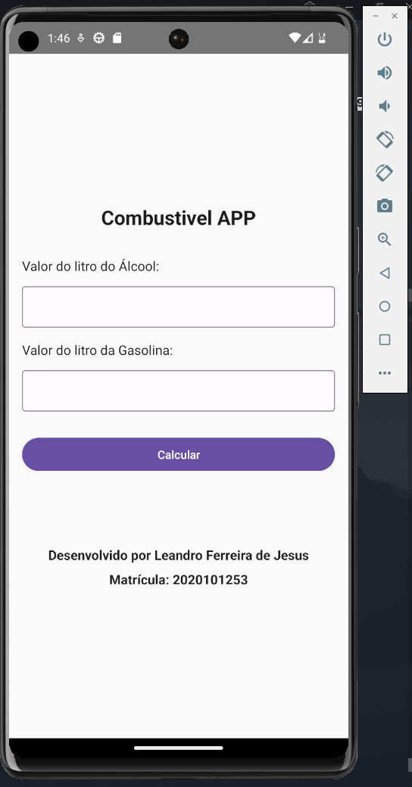
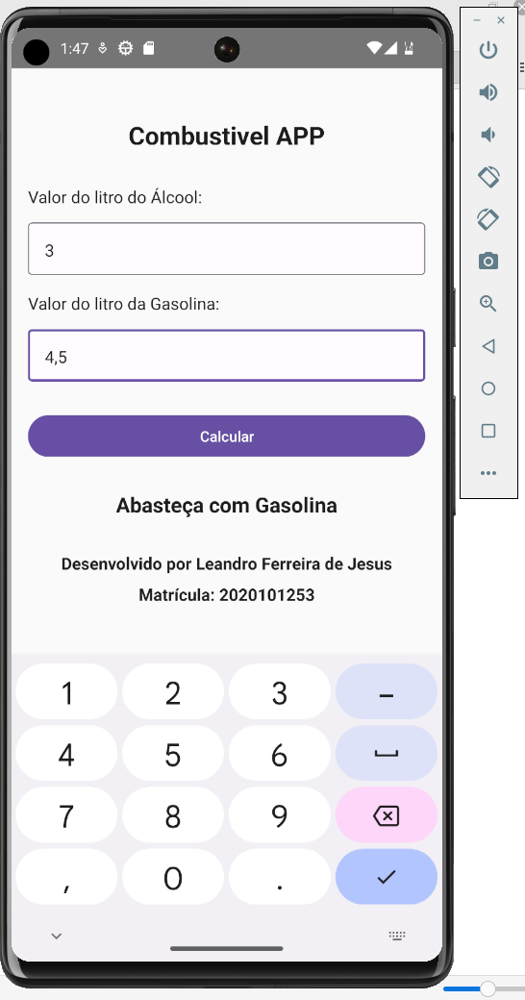
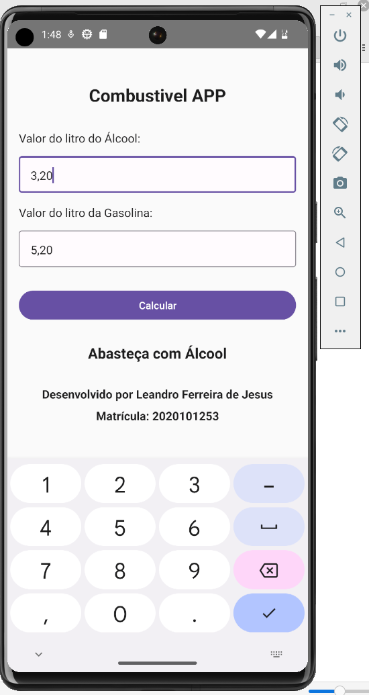

# APS - 132 - DESENVOLVIMENTO DE APLICAÇÕES MÓVEIS 2023/1

Aplicatico para calculos de preço de combustivel

Desenvolvido por: Leandro Ferreira de Jesus
Matricula: 2020101253

## Tecnologias utilizadas
- React Native
- React Native Paper
- React Native CLI
- ADV - Android Virtual Device
- Node.js
- npm
- npx

## Como executar o projeto
- Clonar o projeto
- Abrir o terminal na pasta do projeto
- Executar o comando `npm install` para instalar as dependencias
- Executar o comando `npx react-native run-android` para executar o projeto no emulador (Emulado deve estar aberto)

## Imagens do projeto

